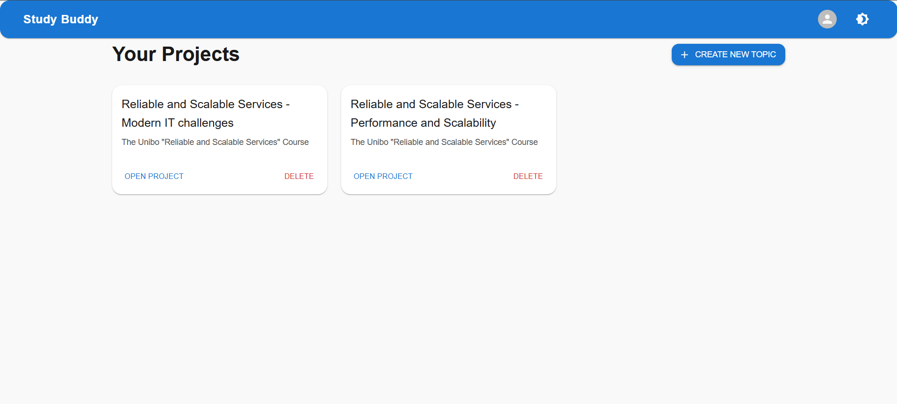
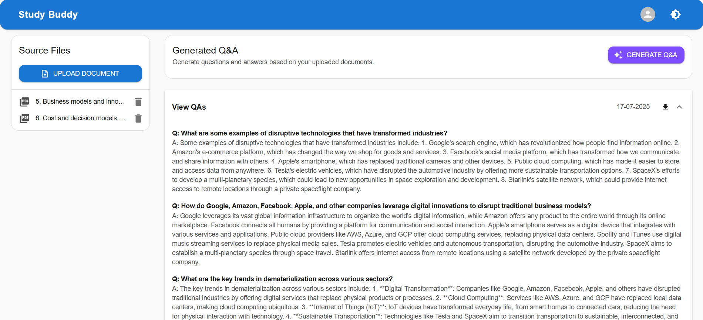
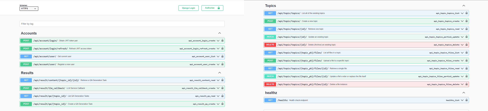
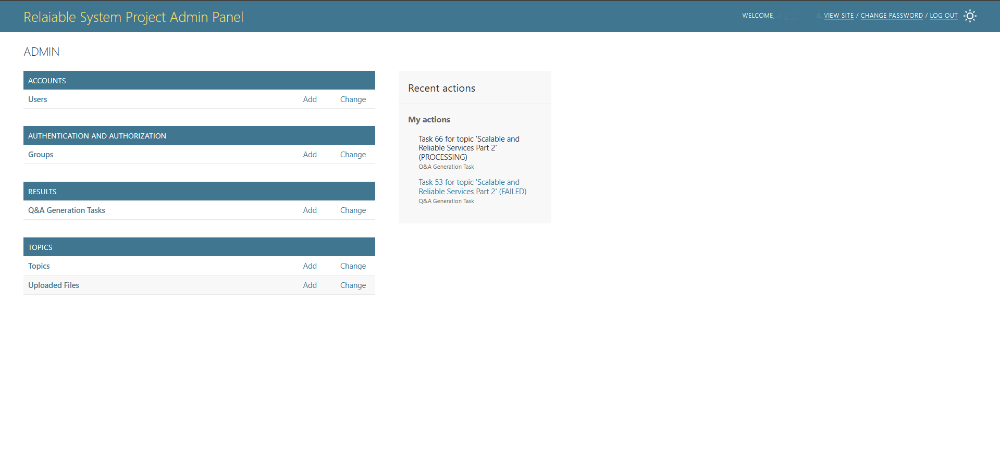

# 🐾 Study-buddy

      
 
 
   

Study Buddy is a microservices-based application designed to help students study smarter. Built as part of the _Scalable and Reliable Services_ course at the University of Bologna, the system ingests educational materials (e.g., PDFs of lecture notes or textbooks) and automatically generates structured _question-and-answer_ guides using Large Language Models (LLMs). This conversational format supports more effective and personalized learning. The application is cloud-native and scalable, making it reliable under varying workloads while respecting user privacy.

---

# 🪄 Inspiration

This project is inspired by the excellent [Study Friend](https://github.com/sangioai/study-friend) by Sangio, which demonstrated a local visual language model capable of extracting Q&A from PDFs.

---

# 🏛️ Architecture

The system consists of three microservices:

- Frontend – A Next.js web app for user interaction
- Backend – A Django-based API that coordinates the system
- LLM Service – Processes PDFs and generates Q&A in markdown format using LLMs

---

# 🏃‍♂️ Running the application locally

This project includes Docker Compose setups for each microservice in their respective directories. To run everything together, a root-level `docker-compose.yml` is provided, for which you need to ensure that all `.env` files are properly configured as described in each service's README.

## Instructions ⚙️

### 1. 🔐 Configure the `.env` files of each microservice

To do this, refer to the README files located at _/backend_, _/llm-service_, and _/frontend_.

### 2. 🔐 Create a `.env` file at the root

Make a copy of `.env.production.example` and rename it as `.env`. Then edit `.env` file as follows:

- **Database** configurations. The following 3 variables are common between the `.env` file you are currently building, and the `.env` from backend microservice. In order not face conflict, they need to have similar values across both `.env` files.  
  `NAME=your_db_name`
  `USER=your_db_user`
  `PASSWORD=your_db_password`

### 3. 📦 Create Docker volumes and network

you must create the external volumes and network used by docker-compose.yml:

```bash
docker volume create pgdata
docker volume create static_volume
docker volume create media_volume
docker volume create rd1-data
docker volume create rd2-data
docker network create app-network
docker network create llm-app-network
docker network create frontend-network
```

### 4. 🚀 Run the containers

Start the application stack (remember to change directory to where `docker-compose.yml` file exists):

```bash
docker-compose up --build -d
```

You can check the state of containers:

```bash
docker ps -a
```

## 🌐 Accessing the Application

- Admin Panel of backend: http://localhost/admin/
- Swagger API Docs of backend: http://localhost/docs/
- Swagger API Docs of llm service: http://localhost:8001/docs/

## Clean Up 🧹

To stop and remove all containers:

```bash
docker-compose down -v
```

---

# 🏃‍♂️ Running the application on GCP

Deployment is handled via Google Kubernetes Engine (GKE) and fully automated using Terraform. The Terraform setup is split into two parts:

- `/terraform/infra`: Provisions cloud infrastructure
- `/terraform/k8s`: Deploys the microservices to GKE

A remote GCP bucket is used to store the `default.tfstate` file, allowing fully online variable fetching. This prevents hardcoding, enables collaborative development, and avoids state file conflicts across environments.

> **Note**: A valid GCP billing account is required to deploy this project.

## Instructions ⚙️

### 1. 🔐 Configure the `terraform.tfvars` files

Rename and edit the variable files in both directories:

- `/terraform/infra`: Rename `terraform.tfvars.example` → `terraform.tfvars` and adjust the values
- `/terraform/k8s`: Rename `terraform.tfvars.example` → `terraform.tfvars` and adjust the values

### 2. 🚀 Run the Terraform commands

Navigate to `/terraform/infra` and run:

```bash
terraform init
terraform apply
```

After infrastructure provisioning is complete, move to `/terraform/k8s` and repeat the same commands

## 🔎 Generate a DNS

To enable HTTPS access with an SSL certificate, you'll need a DNS name for your deployment.

- Use an existing domain you own **or** create a free subdomain via [DuckDNS](https://www.duckdns.org)
- Once you have your DNS, add it to the `terraform.tfvars` file inside `/terraform/k8s` under the appropriate variable (Add it to the list of `ALLOWED_HOSTS` and set `NEXT_PUBLIC_API_URL = "your-subdomain.duckdns.org"`)

This DNS is required for generating valid SSL certificates and accessing the deployed app securely via a custom URL.

## 🫧 Google Cloud Architecture


## 🚗 CI/CD Pipeline Overview

There are two components in the CI/CD setup for automated deployment:

1. **`cloudbuild.yaml`**

   - Builds Docker containers
   - Publishes them to **Google Artifact Registry**
   - Essential for Google Cloud (not used with Docker Compose)
   - To use it:
     - Set up a **Build Trigger** in Google Cloud connected to your GitHub repo
     - In the build configuration (step zero), manually change **3 flags** to `false` and commit the changes to trigger the build

2. **`.github/cicd-pipeline.yml`**
   - Lints the `/terraform/k8s` configuration
   - Creates a **GitHub Issue** with proposed changes for review
   - This is **optional** and not required to run the app—Terraform can be executed manually

---

# 🖼️ Screenshots

### 📘 UI - Dashboard



### 📘 Uploaded PDFs and Generated Q&As



### 📘 Swagger APIs



### 📘 Admin Panel


