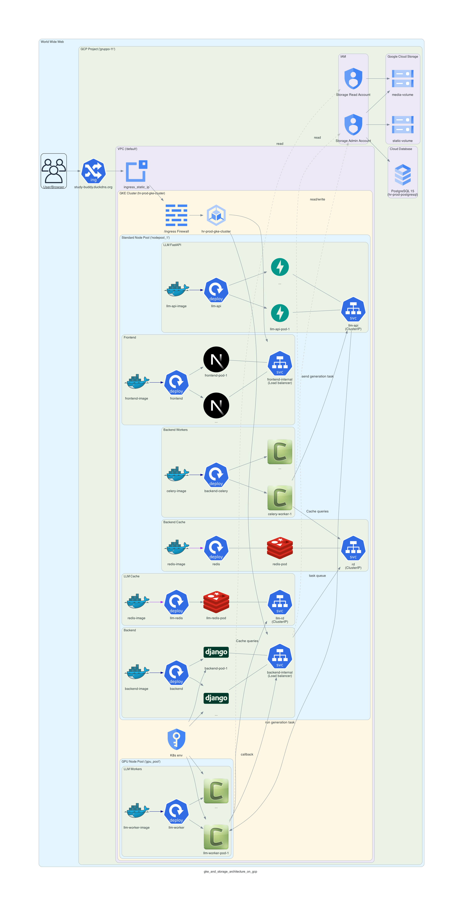

# study-buddy 🐾

This repository created for the Scalable and Reliable Services project examination. Now that it is over, we wish to document it for anybody else to deploy, fork, and learn from!

# Objective 🌟

Inspired by the amazing work by Sangio:
[Study Friend](https://github.com/sangioai/study-friend)

He created a local visual language model capable of ingesting PDF documents and producing question answer pairs.

The project is divided into three microservices

- Frontend: Hosts a NextJS website

- Backend: Coordinates the application through API's in Django

- LLM-Service: Consumes PDF files to generate markdown files


# Local Testing and Deployment 🔨
- In order to run the application locally, there are docker-compose files written for every microservice, in the folders of similar name to those services. 

- For deployment, we have used google cloud GKE and a Terraform to automate this process. Also, there is a sample *terraform.tfvars.example* already present in the repo, which you can rename it to *terraform.tfvars* and use it for environment variables.

**Quickstart**

1) Go inside /terraform/infra and create a terraform.tfvars from the sample
2) Run `terraform init`
3) Run `terraform apply`
4) Go inside /terraform/k8s and create another terraform.tfvars from the sample
5) Run `terraform init`
6) Run `terraform apply`

Your project is now deployed on Google Kubernetes Engine!

# Generate a DNS 🔎

You need a DNS to create the SSL certificate to connect to the project over SSL with a URL. Use one you already own, or create on for free on [DuckDNS](https://www.duckdns.org). Then, put it inside the terraform.tfvars inside /terraform/k8s

# Google Cloud Architecture 🫧



The project runs in Kubernetes for maximum performance and configuration. There are two parts in the CI/CD for automatic deployment, `cloudbuild.yaml` which builds the docker containers and publishes them to the Artifact Registry. This is important for Google Cloud, but not Docker Compose. To use it, set up a build trigger on Google Cloud that is integrated to your GitHub repo. Then, there are 3 flags in step zero, that have to be manually modified to `false` and committed to make that part build.

 The other part is `./github/cicd-pipeline.yml` which lints the `/infra/k8s` and creates a GitHub issue with the proposed changes to be applied, that the repository owners must approve or deny. This is not critical to use the application, you can run all *terraform* commands locally.

# Building Criteria

1. Stateless Frontend (only user authentication on browser)
2. Stateless LLM Service
3. Minimal State Backend (SQL)

---

## Local Setup Instructions ⚙️

### 1. 🔐 Create a `.env` file

Make a copy of `.env.production.example` and rename it as `.env`. Then edit `.env` file as follows:

- **Database** configurations. The following 3 variables are common between the current `.env` file you are currently building, and the `.env` from backend directory. In order not face conflict, they need to have similar values across both `.env` files.  
  `NAME=your_db_name`
  `USER=your_db_user`
  `PASSWORD=your_db_password`

## 2. Create Docker volumes and network 📦

you must create the external volumes and network used by docker-compose.yml:

```bash
docker volume create pgdata
docker volume create static_volume
docker volume create media_volume
docker volume create rd1-data
docker volume create rd2-data
docker network create app-network
docker network create llm-app-network
```

## 3. Run the containers 🚀

Start the application stack (remember to change directory to where `docker-compose.yml` file exists):

```bash
docker-compose up --build -d
```

You can check the state of containers:

```bash
docker ps -a
```

---

## 🌐 Accessing the Application

- Admin Panel of backend: http://localhost/admin/
- Swagger API Docs of backend: http://localhost/docs/
- Swagger API Docs of llm service: http://localhost:8001/docs/

---

## 🧹 Clean Up

To stop and remove all containers:

```bash
docker-compose down -v
```
